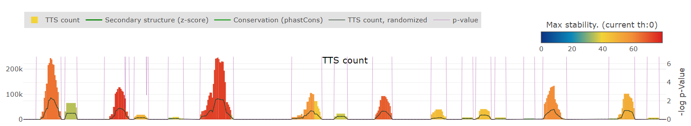

[](https://snakemake.bitbucket.io)


# Introduction

3plex is a framework for predicting ssRNA:dsDNA interaction through triple helix (triplex) formation.

3plex integrates the state-of-the-art algorithm for triplex identification with relevant biophysical knowledge on triplex structures: thermal stability derived from triplex denaturation experiments and RNA secondary structure prediction.

The `PATO` algorithm (Amatria-Barral et al., 2023) scans a couple of nucleotide sequences and returns all the triplexes that satisfy a set of user-defined constraints.

3plex enables the exclusion of ssRNA nucleotides from the search based on the secondary structure prediction performed with `RNAplfold` from the ViennaRNA package (Lorentz et al., 2011). Theoretically, a triplex interaction requires a stretch of nucleotides on the ssRNA transcript not to be involved in any further hydrogen bond.

The identified putative triplexes are evaluated according to their thermal stability derived from the `LongTarget` collection of triplex denaturation experiments (He et al., 2015).

Extensive description of the tool can be found in our paper:


>__3plex enables deep computational investigation of triplex forming lncRNAs.__<br>
> Cicconetti C, Lauria A, Proserpio V, Masera M, Tamburrini A, Maldotti M, Oliviero S, Molineris I.<br>
> Comput Struct Biotechnol J. 2023 May 17;21:3091-3102. doi: [10.1016/j.csbj.2023.05.016](https://www.sciencedirect.com/science/article/pii/S2001037023001988). PMID: [37273849](https://pubmed.ncbi.nlm.nih.gov/37273849/); PMCID: PMC10236371.


**Abbreviations**

`ssRNA`: single-stranded RNA

`dsDNA`: double-stranded DNA

`TFO`: Triplex-Forming Oligo (the ssRNA region that binds the DNA)

`TTS`: Triplex Target Site (the dsDNA region bound by the ssRNA)

`DBD`: DNA Binding Domain (the ssRNA region identified from the overlap of multiple TFOs)


---

# Web interface

A web interface is available at https://3plex.unito.it/. 

Using the 3plex web platform, the user can:
* Submit jobs to 3plex for remote execution on our server, using a web interface. The user is notified by mail upon job completion.
* Submit jobs with user-provided inputs or with pre-computed transcripts and sets of promoters.
* Download raw 3plex outputs.
* Interactively visualize, filter, and navigate results.


## Main functionalities
### 3plex prediction
Run 3plex on user-provided sequences or pre-computed transcripts and promoters.
### Randomized track
If the box Randomized dsDNA is checked, the system will compare the predictions on the target dsDNA to predictions on a randomized version of it. This functionality computes a p-value for the number of TTS found. The allowed number of repetitions is 10, 100, 500 and 1000.
### Data visualization
An interactive data visualization platform shows a TTS count plot, with the possibility of filtering TPX by a minimum stability threshold; if the randomized track is available, a p-value track is shown as well. If the dsDNA is specified in bed format, the same plot can be opened on the Genome Browser.
Additionally, secondary structure, conservation and repeats tracks are provided.

The user can manually specify DBDs and access individual TPX in the ranges. 

### Promoter TPX stability test
The web interface allows to remotely perform the promoter TPX stability test as described in the [corresponding section](#promoter-tpx-stability-test-1)

# Run 3plex with Docker

Pull the latest image from the Docker hub:
```
docker pull imolineris/3plex:v1.0
```
How to run:
```
docker run -u `id -u`:`id -g` -it --rm -v $PWD:$PWD imolineris/3plex:v1.0 $PWD/ssRNA.fa $PWD/dsDNA.fa $PWD/results_3plex
```

###  Required arguments
```
ssRNA.fa          	The RNA sequence in FASTA format. The file must contain only one sequence.
dsDNA.fa          	The DNA sequences in multi-FASTA format.
outdir             	Absolute path to output directory.
```

See the example of [ssRNA.fa](https://github.com/molinerisLab/3plex/blob/main/test/SRA1.fa) and [dsDNA.fa](https://github.com/molinerisLab/3plex/blob/main/test/MANE.GRCh38.v1.1.refseq_genomic.Symbol.tss.1500_500.subset.fa).

### Options
 
```
-j CPUS, --jobs CPUS    Number of parallel threads.
-l N, --min_length N    Minimum triplex length required. Allowed values: N>=5. [ Default: 10 ]
-e E, --error_rate E    Maximum percentage of error allowed in a triplex. [ Default: 20 ]
-s S, --single_strandedness_cutoff S
                        Percentage of masked RNA nucleotides based on RNAplfold base pairing probabilities. [ Default: 0 ]
-c C, --consecutive_errors C
                        Maximum number of consecutive errors allowed in a triplex. [ Default: 1 ]
-g G, --guanine_rate G
                        Minimum percentage of guanines required in a TTS. [ Default: 40 ]
-r, --filter_repeat     If enabled, exclude repeat and low complexity regions. [ Default: FALSE ]
-L M, --max_length M    Maximum triplex length permitted, M=-1 imply no limits. [ Default: -1 ]
-t T, --pato_other_parameters T
                        Additional pato parameters passed as a string (e.g. -t '-mamg 90 -E 4'). 3plex output format will not change.
--pato_simultaneous_sequences SIM_SEQ
                        Maximum number of sequences that may be processed simultaneously (less simultaneous sequences equals less memory usage). [ Default: 256 ]
--RNAplfold_window_size W_SIZE
                        RNAplfold: average pair probabilities over windows of specified size. [ Default: 200 ]
--RNAplfold_span_size W_SPAN
                        RNAplfold: maximum separation of a base pair permitted. [ Default: 150 ]
--RNAplfold_unpaired_window W_LEN
                        RNAplfold: mean probability that regions of specified W_LEN are unpaired. [ Default: 8 ]
--RNA2D_out PATH        Output the RNAplfold modified z-score in this PATH.
```

> :warning: If you get a *MissingInputException* error make sure your input files are accessible by the user or the group specified in Docker. Pay attention to symlink outside to the mounted volume.

> :warning: If you get no output and docker exit with the 139 status the host linux-kernel version is >= 4.8 and you need to enable vsyscall at startup, see https://helpcenter.onlyoffice.com/installation/mail-enabling-vsyscall.aspx.

### Output

3plex returns one tab-delimited file listing all the TFO:TTS matches: *_tpx.stability.gz_

| Sequence_ID | TFO_start | TFO_end | Duplex_ID                         | TTS_start | TTS_end | Score | Error_rate | Errors | Motif | Strand | Orientation | Guanine_rate | Stability | aln1                | aln2                     | aln3                     | aln4                     |
|-------------|-----------|---------|------------------------------------|-----------|---------|-------|------------|--------|-------|--------|-------------|---------------|-----------|--------------------|--------------------------|-------------------------|--------------------------|
| SRA1        | 149       | 159     | CCDC27::chr1:3750949-3752950      | 177       | 187     | 8     | 0.2        | b1o3   | Y     | -      | P           | 0.4           | 32.8      | 5'- CGTTTCCCTT -3' | TTS: 3'- GcAAAGGGAA -5'  | \|\*\|\*\|\|\|\|\|\|     | TFO: 3'- CgTgTCCCTT -5'  |
| SRA1        | 150       | 160     | MEGF6::chr1:3611007-3613008       | 673       | 683     | 8     | 0.2        | b2b4   | Y     | -      | P           | 0.5           | 36.4      | 5'- CCGTATCCCT -3' | TTS: 3'- GGcAtAGGGA -5'  | \|\|\*\|\*\|\|\|\|\|     | TFO: 3'- CCgTgTCCCT -5'  |
| SRA1        | 149       | 160     | TTC34::chr1:2801192-2803193       | 1020      | 1031    | 9     | 0.18       | b2o4   | Y     | -      | P           | 0.45          | 40.1      | 5'- CCATTTCCCTT -3'| TTS: 3'- GGtAAAGGGAA -5' | \|\|\*\|\*\|\|\|\|\|\|   | TFO: 3'- CCgTgTCCCTT -5' |


and a second tab-delimited file reporting a summary triplex score for each dsDNA sequence: *_tpx.summary.add_zeros.gz_ 

| Duplex_ID                 | Sequence_ID | Total(abs) | Total(rel)  | GA(abs) | GA(rel)   | TC(abs) | TC(rel)   | GT(abs) | GT(rel)   | Duplex_length | Stability_best | Stability_tot | Score_best | Stability_norm         |
|---------------------------|-------------|------------|-------------|---------|-----------|---------|-----------|---------|-----------|----------------|----------------|---------------|------------|-----------------------|
| OR4F5::chr1:63918-65919   | SRA1        | 158        | 2.77e-08    | 43      | 7.55e-09  | 43      | 7.55e-09  | 72      | 1.26e-08  | 2001           | 53.8           | 481.3         | 12         | 0.240                 |
| OR4F29::chr1:451177-453178| SRA1        | 132        | 2.32e-08    | 25      | 4.39e-09  | 24      | 4.21e-09  | 83      | 1.46e-08  | 2001           | 42.5           | 652.9         | 12         | 0.326                 |
| OR4F16::chr1:686153-688154| SRA1        | 125        | 2.2e-08     | 24      | 4.21e-09  | 24      | 4.21e-09  | 77      | 1.35e-08  | 2001           | 42.5           | 623.9         | 12         | 0.311                 |


**Available triplex scores**

`Stability_best`: the stability score of the most stable TFO:TTS couple among the predicted ones.

`Stability_tot`: the sum of the stability scores of overlapping TTSs (highest value).

`Stability_norm`: the dsDNA length normalised Stability_tot score.

`Score_best`: PATO best score (sum of the matches).


---

# 3plex Snakemake workflows

The following section illustrates how to perform 3plex downstream analyses to evaluate the significance of the triplex-forming capability of an ssRNA.

The workflows are handled with [Snakemake](https://snakemake.github.io/) and structured with [dap](https://github.com/molinerisLab/dap).

## Setup

3plex can be used through a Singularity container or set up manually.

### Setup with Singularity
This section provides instructions to build the Singularity container to run 3plex.

* Ensure you have [Singularity](https://docs.sylabs.io/guides/3.0/user-guide/installation.html) installed on your machine.
* Clone this repository `git clone https://github.com/molinerisLab/3plex`
* Enter the repository directory and run `sudo ./build_singularity_container.sh`
    * By default the script creates the container image as a *.sif* file in the current directory. Different paths can be specified as an additional argument `./build_singularity_container.sh path/to/image.sif`.


#### Open a shell inside the container

Once the Singularity image has been built, 3plex can be used by opening a shell inside the container. The shell will open with the environment already setup.
```
./run_singularity_container.sh --MOUNT_DIRECTORY path/to/directory
```
* The **3plex directory is automatically mounted inside the container** and the shell opened inside it. Any data generated in dataset/ is accessible from outside the container.
* `--MOUNT_DIRECTORY path/to/directory` allows to mount an additional directory inside the container. This is needed, for example, to provide a *genome fasta file* for the workflows. 
* Optional, `--TARGET_PATH path/to/image.sif` allows to open a singularity image from a custom path.

### Manual setup

This section provides instructions to set up 3plex manually without Singularity.

#### Install the requirements
```
* PATO
* gawk
* conda
* (optional) direnv
* (optional) DAP
```
Find the [installation guide for PATO](https://github.com/UDC-GAC/pato) here.

We suggest to install [direnv](https://direnv.net/) for automatic environment variables management. If not installed, some environment variables will have to be defined manually.

#### Clone and setup 3plex
Clone the repository, move inside `3plex` directory and, if installed, allow direnv:
```
git clone git@github.com:molinerisLab/3plex.git
cd 3plex
direnv allow
```

Create and activate the conda environment:
```
conda env create --file=local/envs/3plex.yaml
conda activate 3plex_Env
```

If direnv is not installed, manually define the environment variables
```
export PRJ_ROOT={3plex_root_directory}
export PATH=$PATH:$PRJ_ROOT/local/bin
```

### Manage data analysis versions

The adopted convention is dividing the work into *versions*, each characterized by its input data and configurations. Versions are located in `$PRJ_ROOT/dataset`. 
```
cd v1
```
#### Create new versions
New versions can be created by cloning existing ones using our project management tool, included in the 3plex_Env conda environment: `dap clone v1 v2`.

The cloning version results in a new directory in the dataset/ directory containing:
* Symbolic links to the Snakefile and the global configuration.
* A symbolic link to a version-specific configuration `config.yaml --(links to)--> local/config/config_v{version}.yaml`, which is initially copied from the previous version.
* Any symbolic link linking to files contained in the `PRJ_ROOT/local/*` directory that were present in the previous version.

## Raw triplex prediction

This workflow produces the raw  _tpx.stability.gz_ and _tpx.summary.add_zeros.gz_ files previously described. An ssRNA FASTA file and a dsDNA multi-FASTA or BED file are required.

* Specify the `ssRNA` and `dsDNA` paths in the `config.yaml`. 
* Specify the path in `genome_fasta` to allow for *.bed* inputs.
    * (Note) if running inside the singularity container, the user can specify the option `--MOUNT_DIRECTORY` to mount an additional directory during launch.

Then run:

```
snakemake -j CORES run_raw_tpx_prediction
```


## Promoter TPX stability test

This workflow allows the integration of gene expression data to characterize the triplex-forming potential of the investigated ssRNA.

Starting from a list of the "universe of genes" (e.g., all the expressed genes in the system) and a list of genes of interest (e.g., differentially expressed genes identified upon an ssRNA KD):

1. retrieve the promoters associated with the universe of genes (we suggest to refer to [MANE](http://www.ensembl.org/info/genome/genebuild/mane.html), but a custom selection of promoters is allowed);
2. run 3plex to find the putative triplexes formed by the ssRNA and the set of promoters;
3. compare the stability of the putative triplexes formed with promoters of genes of interest with all the remaining genes (Wilcoxon's test);
4. perform a [gene set enrichment analysis](https://www.gsea-msigdb.org/gsea/index.jsp) ranking the universe of genes according to their triplex stability score thus computing the significance of the enrichment in promoters with a high or a low stability score. The [leading edge](https://www.gsea-msigdb.org/gsea/doc/GSEAUserGuideTEXT.htm#_Running_a_Leading_Edge%20Analysis) table provides a selection of candidate target genes.

Modify the `Promoter stability test` section in the `config.yaml` according to your needs following the comments. Then run:

```
snakemake -j CORES run_promoter_tpx_stability_test
```

Find the results in the `results` directory. 

To produce an HTML report, run the following command after the workflow is completed:

```
snakemake -j CORES run_promoter_tpx_stability_test --report report.html
```

## Random regions test

This workflow tests the triplex-forming capability of each ssRNA portion, namely the DBDs. 

This result is achieved by comparing the stability of the DBDs' putative triplexes identified considering a set of target regions (e.g., ChIRP-seq data) with a null distribution built on the stability scores obtained testing randomized genomic regions N times.

Operatively:

1. run 3plex on the set of target regions and define the DBDs as the union of the overlapping TFOs;
2. generate N times the same number of regions with bedtools shuffle, excluding blacklist regions. 3plex is run each time to retrieve the TTS count and stability of the triplexes;
3. Compute the empirical p-value for each DBD by counting the number of times the upper quartile of the DBD's putative triplexes' score is lower than the upper quartile obtained with random genomic regions.

Modify the `Random region test` section in the `config.yaml` according to your needs following the comments. Then run:

```
snakemake -j CORES run_random_region_test
```

Find the results in the `results` directory. 

---

# Poster


